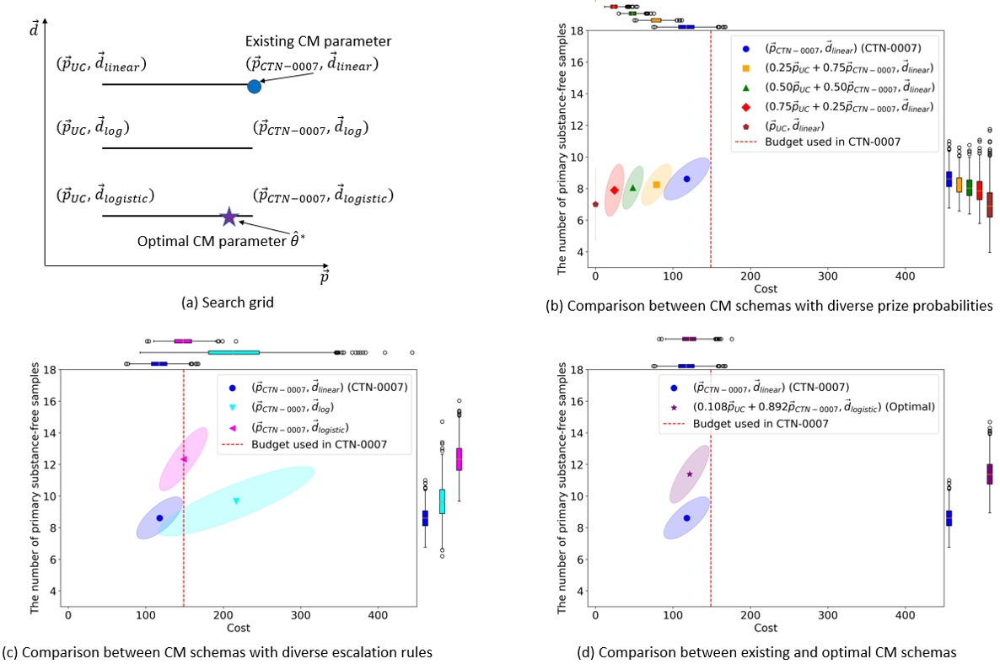

# Optimizing-Contingency-Management-with-Reinforcement-Learning

This repository provides python implementation for our paper 'Optimizing Contingency Management with Reinforcement Learning'.


*Illustration of CM parameters with the search grid and comparisons between costs and the number of primary substance-free samples from various CM schemas, including existing and optimal ones under the budget used in CTN-0007. A detailed caption for this figure was provided in the manuscript.*

## 1. Tutorial
### 1.1. Example code
We provided an example code to generate synthethic CM data and to compute off-policy evaluation importance sampling estimators for any user-specified CM schema. The main function is the ``compute_ipw_estimate`` in ``utils.py``. Users can adjust variables target_prize_prob_list and target_escalation_rule to try their prize probabilities and ticket escalation rules. The example implementation result was provided in ``example code.ipynb``. Note that the generated data were different from the real CTN-0007 study data. To reproduce our main result, please read and follow the next subsection.
```python
import numpy as np
import utils as UTILS

n_sample = 50 # sample size
base_prize_prob_list = [0.5, 0.418, 0.08, 0.002] # prize probabilities for the CM in CTN-0007
base_escalation_rule = [1, 2, 3, 4, 5, 6, 7, 8, 9, 10, 11, 12] # ticket escalation rule for the linear rule in CTN-0007

# list of primary and secondary substances
primary_substance_list = ['ALCOHOL', 'AMPHETAMINE', 'COCAINE', 'METHAMPHETAMINE']
secondary_substance_list = ['OPIOID']

# generate example data
df_example = UTILS.generate_data(n_sample, base_prize_prob_list, base_escalation_rule,
                                 primary_substance_list, secondary_substance_list, seed=0)

reward_name_list = ['primary substance-free', 'secondary substance-free', 'incentives']

target_prize_prob_list = [0.5, 0.418, 0.08, 0.002] # prize probabilities for the new CM schema
target_escalation_rule = [1, 2, 3, 4, 5, 6, 7, 8, 9, 10, 11, 12] # ticket escalation rule for the new CM schema

results = UTILS.compute_ipw_estimate(dataframe=df_example,
                                     reward_name_list=reward_name_list,
                                     base_prize_prob_list=base_prize_prob_list,
                                     target_prize_prob_list=target_prize_prob_list,
                                     base_escalation_rule=base_escalation_rule,
                                     target_escalation_rule=target_escalation_rule)

print('< Off-policy evaluation results >')
for reward_name in reward_name_list:
    print('reward name = %s, value (estimated with importance sampling estimator) = %.3f'
          % (reward_name, np.mean(results[reward_name])))
    del(reward_name)
```

### 1.2. Experimental results
For implementations to get results in our experiments, please run notebook files provided in the ``experiments`` folder. First, download real data from CTN data repository: http://datashare.nida.nih.gov/study/nida-ctn-0007. Then, check and run ``1.Data_preprocess.ipynb`` and ``2.OPE.ipynb`` files. With the saved result, users can reproduce main figures using ``3.Comparison_prize_probs.ipynb``, ``4.Comparison_ticket_escalation_rules.ipynb``, and ``5.Comparision_optimal_schema.ipynb``.

## 2. Package dependencies
- matplotlib==3.5.1
- numpy==1.21.5
- pandas==1.3.5
- python==3.10.12
- scipy==1.8.0
- sklearn==1.3.0

## 3. License
This project is licensed under the terms of the MIT License. This means you can freely use, modify, and distribute the code, as long as you provide attribution to the original authors and source.


